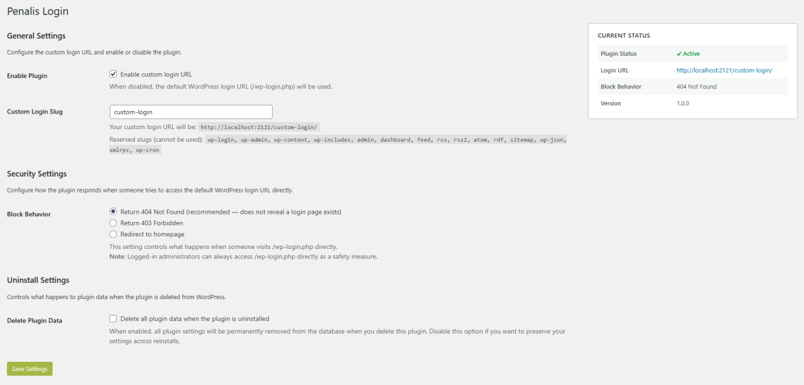

# Penalis Login

A WordPress plugin that replaces the default WordPress login URL (`/wp-login.php`) with a custom slug of your choice. Direct access to `/wp-login.php` is blocked with a configurable response (404, 403, or redirect).

This plugin was originally developed for internal use at [Penalis](https://penalis.com). It is publicly available so others can use it in their own projects if they find it useful.



## Features

- Replaces `/wp-login.php` with a custom login slug (default: `/login/`)
- Blocks direct access to `/wp-login.php` with configurable behavior (404, 403, or redirect)
- Filters all WordPress-generated login/logout/lost-password/register URLs
- Anti-lockout: logged-in administrators can always access `/wp-login.php` directly
- Compatible with WooCommerce, REST API, XML-RPC, admin-ajax, and application passwords
- Settings page under **Settings → Penalis Login**
- Rewrite rules flushed only on activation/deactivation or slug change (not on every request)
- Optional Nginx integration via a REST endpoint for automatic slug-aware rate limiting and basic auth

## Requirements

- PHP 8.1+
- WordPress 6.4+

## Installation

1. Download the latest ZIP from the [Releases](../../releases) page
2. In WordPress admin, go to **Plugins → Add New → Upload Plugin**
3. Upload the ZIP and click **Install Now**, then **Activate**
4. Go to **Settings → Penalis Login** to configure

## Folder Structure

```
penalis-login/
├── penalis-login.php          # Bootstrap / plugin header
├── uninstall.php              # Cleanup on uninstall (removes DB options)
├── nginx-auth-request.conf.example  # Example Nginx auth_request integration
├── src/
│   ├── Plugin.php             # Service container / singleton orchestrator
│   ├── Activator.php          # Activation / deactivation hooks
│   ├── Helpers.php            # Shared utilities, option reads, slug validation
│   ├── RewriteHandler.php     # Rewrite rules & routing
│   ├── UrlFilter.php          # login_url / logout_url / etc. filters
│   ├── SecurityHandler.php    # Block wp-login.php, anti-lockout
│   ├── Admin/
│   │   └── SettingsPage.php   # Settings → Penalis Login
│   └── Api/
│       └── LoginSlugEndpoint.php  # REST endpoint for Nginx auth_request
└── assets/
    └── admin.css              # Admin page styles
```

## Settings

| Setting | Description | Default |
|---|---|---|
| Enable Plugin | Toggle the custom login URL on/off | Enabled |
| Custom Login Slug | The URL slug for the login page | `login` |
| Block Behavior | What happens when `/wp-login.php` is accessed directly | 404 |
| Delete Plugin Data | Delete all plugin data from the database when the plugin is uninstalled | Disabled |

### Block Behavior Options

- **404 Not Found** *(recommended)* — Returns a proper 404 using the theme's 404 template. Does not reveal that a login page exists.
- **403 Forbidden** — Returns a 403 response via `wp_die()`.
- **Redirect to homepage** — Redirects the visitor to the site homepage with a 302.

### Slug Validation

When saving a custom login slug, the plugin normalizes and validates the input before storing it:

1. **Normalization** — The slug is passed through WordPress's `sanitize_title()`, which lowercases it, strips HTML, and removes characters that are not alphanumeric, hyphens, or underscores. Spaces and most special characters are converted to hyphens.
2. **Empty check** — If the result after normalization is an empty string (e.g. the input was `@#$%`), the slug is rejected and the previously saved slug is kept.
3. **Reserved slug check** — Slugs that conflict with WordPress core paths (`wp-login`, `wp-admin`, `admin`, `wp-json`, etc.) are rejected.
4. **Post/page conflict check** — If the slug is already used by a published post, page, or custom post type, it is rejected to avoid routing conflicts.

If validation fails at any step, an error notice is shown in the admin and the previously saved slug remains active — the site is never left in a broken state.

## Architecture Notes

### Why rewrite rules instead of `template_redirect`?

Using `add_rewrite_rule()` keeps the plugin inside WordPress's normal routing pipeline. The custom slug is mapped to `index.php?penalis_login=1`, and when that query var is detected, `wp-login.php` is included directly. This avoids output-buffering hacks and keeps WordPress core authentication fully intact.

### Why is `wp-login.php` included rather than redirected to?

Redirecting to `wp-login.php` would expose the native URL in the browser's address bar and in server logs. Including it directly means the custom URL stays in the address bar throughout the entire login flow.

### Why are rewrite rules only flushed on activation/deactivation?

`flush_rewrite_rules()` writes to the database (and `.htaccess` on Apache). Calling it on every request would cause significant performance degradation. The plugin uses a transient flag to schedule a flush for the next request when the slug changes.

### Anti-lockout mechanism

If a logged-in administrator visits `/wp-login.php` directly, the plugin allows access unconditionally. This is the last line of defence against a misconfigured slug permanently locking out the site owner.

## Nginx Integration

The plugin exposes a REST endpoint that Nginx can query via the `auth_request` directive to determine whether an incoming request URI matches the currently configured login slug — without Nginx needing to know the slug itself.

**Endpoint:**
```
GET /wp-json/penalis-login/v1/is-login-slug
```

Nginx passes the original request URI in the `X-Original-URI` header. The endpoint responds with:
- `200` — the URI matches the login slug (Nginx should apply basic auth and rate limiting)
- `403` — the URI does not match (Nginx should serve the request normally)

When the slug is changed in the plugin settings, Nginx picks it up automatically on the next request — no Nginx reload required.

See `nginx-auth-request.conf.example` in the plugin root for a ready-to-use configuration snippet.

## Compatibility

| Feature | Compatible |
|---|---|
| WooCommerce authentication | ✓ |
| REST API (`/wp-json/`) | ✓ |
| XML-RPC | ✓ |
| admin-ajax.php | ✓ |
| Application passwords | ✓ |
| Password-protected posts | ✓ |
| Password reset emails | ✓ |
| GDPR personal data flows | ✓ |
| Multisite | ✗ (single-site only) |

## Edge Cases

### Slug conflicts with existing pages/posts

If the chosen slug is already used by a published post, page, or custom post type, the plugin rejects it with an error notice and keeps the previously saved slug. Choose a slug that doesn't conflict with existing content.

### Caching plugins

After changing the login slug, clear your caching plugin's cache and any server-level cache (Nginx, Varnish, etc.) to ensure the new rewrite rules take effect.

### Multisite

The plugin is designed for single-site installations. On multisite networks, each site would need its own configuration. The current version does not support network-wide settings.

### WooCommerce "My Account" page

WooCommerce has its own login form on the My Account page. The plugin does not interfere with this — WooCommerce uses its own endpoint, not `wp-login.php`.

## Uninstalling

Deleting the plugin via **Plugins → Delete** will only remove plugin data from the database if the **Delete Plugin Data** setting was enabled before deletion. If the setting is disabled (the default), all plugin settings are preserved in the database and will be restored if the plugin is reinstalled.

When data deletion is enabled, the following are removed:
- The `penalis_login_settings` option
- The `penalis_login_delete_on_uninstall` option
- The `penalis_login_flush_rules` transient
- Rewrite rules are flushed to restore default WordPress routing

## License

GPL v2 or later. See [LICENSE.txt](./LICENSE.txt) for details.
