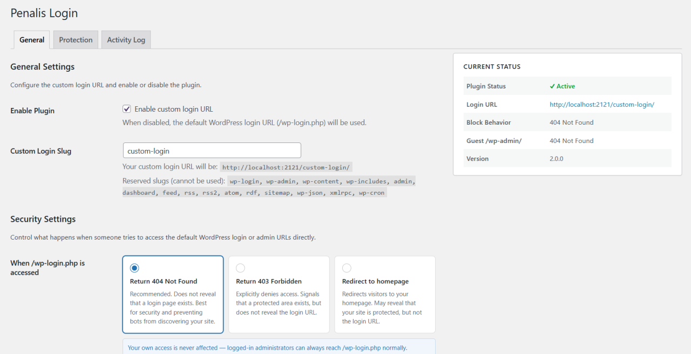
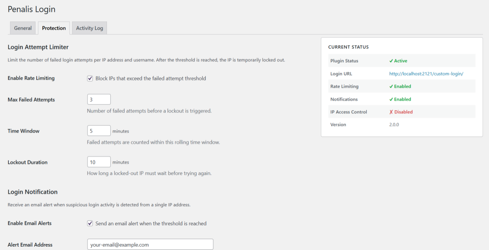
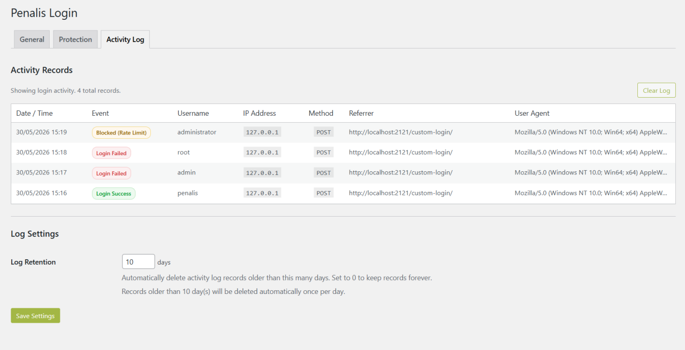

# Penalis Login

A WordPress plugin that replaces the default WordPress login URL (`/wp-login.php`) with a custom slug of your choice, and adds a suite of optional security features to protect the login page from brute force attacks and unauthorized access.

This plugin was originally developed for internal use at [Penalis](https://penalis.com). It is publicly available so others can use it in their own projects if they find it useful.

## Features

### General (always active)
- Replaces `/wp-login.php` with a custom login slug (default: `/login/`)
- Blocks direct access to `/wp-login.php` with configurable behavior (404, 403, or redirect)
- Configurable guest access behavior for `/wp-admin/` — redirect to login, redirect to homepage, 404, or 403
- Filters all WordPress-generated login/logout/lost-password/register URLs
- Anti-lockout: logged-in administrators can always access `/wp-login.php` and `/wp-admin/` directly
- Compatible with WooCommerce, REST API, XML-RPC, admin-ajax, and application passwords
- Optional Nginx integration via a REST endpoint for automatic slug-aware rate limiting

### Protection (optional, disabled by default)
- **Login Attempt Limiter** — rate limits failed login attempts per IP and username; locks out offending IPs for a configurable duration
- **Login Notification** — sends an email alert when a suspicious number of failed attempts is detected from a single IP
- **IP Access Control** — blocklist specific IPs from the login page, or restrict access to an allowlist of trusted IPs only
- **Trusted Proxies** — configure trusted reverse proxy IPs (Cloudflare, Nginx) so security features use the real visitor IP instead of the proxy IP

### Activity Log (always active)
- Records every login attempt (success, failure, blocked by rate limit, blocked by IP rule) with IP address, username, HTTP method, referrer, user agent, and timestamp
- Viewable in the **Activity Log** tab; supports pagination and one-click log clearing
- Configurable log retention — automatically prune records older than N days via daily cron (0 = keep forever, default: 30 days)

## Requirements

- PHP 8.1+
- WordPress 6.4+

## Installation

1. Download the latest ZIP from the [Releases](../../releases) page
2. In WordPress admin, go to **Plugins → Add New → Upload Plugin**
3. Upload the ZIP and click **Install Now**, then **Activate**
4. Go to **Settings → Penalis Login** to configure

## Folder Structure

```
penalis-login/
├── penalis-login.php               # Bootstrap / plugin header
├── uninstall.php                   # Cleanup on uninstall
├── nginx-auth-request.conf.example # Example Nginx auth_request integration
├── src/
│   ├── Plugin.php                  # Service container / singleton orchestrator
│   ├── Activator.php               # Activation / deactivation hooks
│   ├── Helpers.php                 # Shared utilities, option reads, slug validation
│   ├── RewriteHandler.php          # Rewrite rules & routing
│   ├── UrlFilter.php               # login_url / logout_url / etc. filters
│   ├── SecurityHandler.php         # Block wp-login.php, anti-lockout
│   ├── ActivityLogger.php          # Login event recorder
│   ├── ActivityPruner.php          # Daily cron job for log retention
│   ├── LoginAttemptLimiter.php     # Rate limiting / lockout enforcement
│   ├── LoginNotifier.php           # Email alert dispatcher
│   ├── IpAccessControl.php         # IP blocklist / allowlist enforcement
│   ├── ClientIpResolver.php        # Secure client IP resolution (proxy-aware)
│   ├── Admin/
│   │   ├── SettingsPage.php        # Tab orchestrator for Settings → Penalis Login
│   │   ├── ActivityLogActions.php  # admin-post handler for clearing the log
│   │   └── Tabs/
│   │       ├── GeneralTab.php      # General settings tab
│   │       ├── ProtectionTab.php   # Protection settings tab
│   │       └── ActivityTab.php     # Activity log tab (read-only)
│   ├── Database/
│   │   ├── Schema.php              # Table DDL (create / drop)
│   │   ├── ActivityRepository.php  # CRUD for login activity records
│   │   └── IpRulesRepository.php   # CRUD for IP blocklist / allowlist
│   └── Api/
│       └── LoginSlugEndpoint.php   # REST endpoint for Nginx auth_request
└── assets/
    └── admin.css                   # Admin page styles
```

## Settings

### General Tab



| Setting | Description | Default |
|---|---|---|
| Enable Plugin | Toggle the custom login URL on/off | Enabled |
| Custom Login Slug | The URL slug for the login page | `login` |
| When /wp-login.php is accessed | Response when `/wp-login.php` is accessed directly | 404 Not Found |
| When /wp-admin/ is accessed while logged out | Response when a guest visits `/wp-admin/` | Redirect to login |
| Delete Plugin Data | Remove all plugin data from the database on uninstall | Disabled |

### Protection Tab

All protection features are **disabled by default**. Enable each one individually as needed.

#### Login Attempt Limiter



| Setting | Description | Default |
|---|---|---|
| Enable Rate Limiting | Block IPs that exceed the failed attempt threshold | Off |
| Max Failed Attempts | Number of failures before lockout is triggered | 5 |
| Time Window | Rolling window in which failures are counted | 10 minutes |
| Lockout Duration | How long a locked-out IP must wait | 15 minutes |

When an IP is locked out, the login page returns HTTP 429 and is inaccessible until the lockout expires.

#### Login Notification

| Setting | Description | Default |
|---|---|---|
| Enable Email Alerts | Send an alert when the threshold is reached | Off |
| Alert Email Address | Recipient address (blank = site admin email) | *(blank)* |
| Alert Threshold | Number of failures from one IP that triggers an alert | 5 |

#### IP Access Control

| Setting | Description | Default |
|---|---|---|
| Enable IP Access Control | Enforce IP-based rules on the login page | Off |
| Mode | `blocklist` — deny specific IPs; `allowlist` — allow only listed IPs | blocklist |
| Blocked IPs | One IP per line; inline comments supported (`192.168.1.1 # note`) | *(empty)* |
| Allowed IPs | One IP per line; inline comments supported | *(empty)* |

> **Allowlist warning:** If allowlist mode is active and the list is empty, no one is blocked (fail-open). Add your own IP before enabling allowlist mode.

#### Trusted Proxies

| Setting | Description | Default |
|---|---|---|
| Enable Trusted Proxies | Trust proxy headers from the listed IPs | Off |
| Proxy IP Addresses | One IP per line; inline comments supported | *(empty)* |

When enabled, `CF-Connecting-IP`, `X-Real-IP`, and `X-Forwarded-For` headers are only trusted when the actual `REMOTE_ADDR` matches a listed proxy IP. When disabled, only `REMOTE_ADDR` is used — this is the secure default and cannot be spoofed.

### Activity Log Tab

Read-only view of all recorded login events. Columns: Date/Time, Event, Username, IP Address, Method, Referrer, User Agent. Supports pagination (50 records per page) and a "Clear Log" button.



Event types:
- **Login Success** — successful authentication
- **Login Failed** — wrong password or unknown username
- **Blocked (Rate Limit)** — request blocked by the Login Attempt Limiter
- **Blocked (IP Rule)** — request blocked by IP Access Control

#### Log Settings

| Setting | Description | Default |
|---|---|---|
| Log Retention | Delete records older than this many days (0 = keep forever) | 30 days |

Records are pruned automatically once per day via WordPress cron.

## Architecture Notes

### Why rewrite rules instead of `template_redirect`?

Using `add_rewrite_rule()` keeps the plugin inside WordPress's normal routing pipeline. The custom slug is mapped to `index.php?penalis_login=1`, and when that query var is detected, `wp-login.php` is included directly. This avoids output-buffering hacks and keeps WordPress core authentication fully intact.

### Why is `wp-login.php` included rather than redirected to?

Redirecting to `wp-login.php` would expose the native URL in the browser's address bar and in server logs. Including it directly means the custom URL stays in the address bar throughout the entire login flow.

### Why are rewrite rules only flushed on activation/deactivation?

`flush_rewrite_rules()` writes to the database (and `.htaccess` on Apache). Calling it on every request would cause significant performance degradation. The plugin uses a transient flag to schedule a flush for the next request when the slug changes.

### Anti-lockout mechanism

If a logged-in administrator visits `/wp-login.php` or `/wp-admin/` directly, the plugin allows access unconditionally regardless of the configured block/guest behavior settings. This is the last line of defence against a misconfigured slug permanently locking out the site owner.

### IP spoofing protection

`REMOTE_ADDR` is the only value that cannot be spoofed — it is set by the OS/kernel based on the actual TCP connection. Proxy headers (`X-Forwarded-For`, `CF-Connecting-IP`, `X-Real-IP`) are trivially forgeable. The `ClientIpResolver` class only reads proxy headers when `REMOTE_ADDR` matches a configured trusted proxy IP, preventing attackers from bypassing rate limiting by forging headers.

### Database tables

The plugin creates two custom tables on activation:

| Table | Purpose |
|---|---|
| `{prefix}penalis_login_activity` | Login event log |
| `{prefix}penalis_login_ip_rules` | IP blocklist / allowlist entries |

Tables are created via `dbDelta()` and are safe to call on every activation (create-or-alter, never drops data). A schema version option (`penalis_login_db_version`) ensures tables are created on first boot after an upgrade without requiring a deactivate/reactivate cycle.

## Nginx Integration

The plugin exposes a REST endpoint that Nginx can query via the `auth_request` directive to determine whether an incoming request URI matches the currently configured login slug — without Nginx needing to know the slug itself.

**Endpoint:**
```
GET /wp-json/penalis-login/v1/is-login-slug
```

Nginx passes the original request URI in the `X-Original-URI` header. The endpoint responds with:
- `200` — the URI matches the login slug (Nginx should apply basic auth and rate limiting)
- `403` — the URI does not match (Nginx should serve the request normally)

When the slug is changed in the plugin settings, Nginx picks it up automatically on the next request — no Nginx reload required.

See [nginx-auth-request.conf.example](./nginx-auth-request.conf.example) for a ready-to-use configuration snippet.

## Compatibility

| Feature | Compatible |
|---|---|
| WooCommerce authentication | ✓ |
| REST API (`/wp-json/`) | ✓ |
| XML-RPC | ✓ |
| admin-ajax.php | ✓ |
| Application passwords | ✓ |
| Password-protected posts | ✓ |
| Password reset emails | ✓ |
| GDPR personal data flows | ✓ |
| Multisite | ✗ (single-site only) |

## Edge Cases

### What if I forget my custom login slug?

Logged-in administrators can always access `/wp-login.php` and `/wp-admin/` directly regardless of plugin settings. If you are completely locked out, deactivate the plugin via FTP by renaming the plugin folder in `/wp-content/plugins/`.

### Slug conflicts with existing pages/posts

If the chosen slug is already used by a published post, page, or custom post type, the plugin rejects it with an error notice and keeps the previously saved slug.

### Caching plugins

After changing the login slug, clear your caching plugin's cache and any server-level cache (Nginx, Varnish, etc.) to ensure the new rewrite rules take effect.

### Multisite

The plugin is designed for single-site installations. On multisite networks, each site would need its own configuration. The current version does not support network-wide settings.

### WooCommerce "My Account" page

WooCommerce has its own login form on the My Account page. The plugin does not interfere with this — WooCommerce uses its own endpoint, not `wp-login.php`.

## Uninstalling

Deleting the plugin via **Plugins → Delete** will only remove plugin data from the database if the **Delete Plugin Data** setting was enabled before deletion. If the setting is disabled (the default), all plugin settings are preserved and will be restored if the plugin is reinstalled.

When data deletion is enabled, the following are removed:
- `penalis_login_settings` option
- `penalis_login_delete_on_uninstall` option
- `penalis_login_db_version` option
- All plugin transients (lockout entries, notification flags, etc.)
- Custom database tables (`penalis_login_activity`, `penalis_login_ip_rules`)
- Rewrite rules are flushed to restore default WordPress routing

## License

GPL v2 or later. See [LICENSE.txt](./LICENSE.txt) for details.
